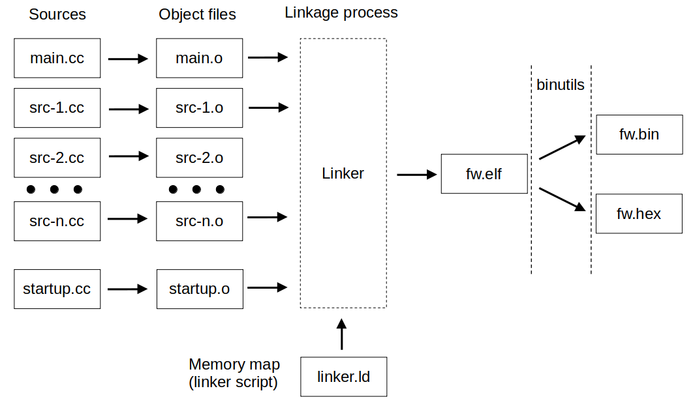

# Tool set for cortex-m code dev on Linux from the ground up. Common principals.

This post discuss the common concepts of the cross-compiling, explain what you need, and what you have to do to build a binary for your target device.<br>
To get an example project for an stm32f103 MCU (blue pill) go to [this post](tool-set-example-for-stm32.md).

Since you are already here, I suppose you have your own vision of the advantages of using open-source/free tools. If that is not the case, I would say that despite its relatively high entry level, the open-source tools will become a more robust, scalable, and predictable "development environment" than any of the IDEs. This is because you will rely solely on vendor libraries (though, in the case of an IDE, you will also rely on them). One day the IDE developer could tell you, "Hey, we decided not to support 'this' feature any more!" Furthermore, you can organize your development process based on your own preferences instead of the capabilities of a particular IDE and finally create the most convenient "development environment" for you. You should just trust me :)

>In this post I will sometime place a text in such '`<>`' an angle brackets like '`your-<command>`'.<br>
In this case you have to replace '`<command>`' by a text appropriate for your particular case like this:<br>
`your-<command>` -> `your-cool_command`

## 1 What is the cross compiling

First of all, if you are not familiar with how programs are built from source, what the preprocessor, compiler, and linker do, I highly recommend you to get familiar with it first. For example, [this post](https://allthingsembedded.com/2018/12/29/cross-compiling-for-embedded-devices/) could be a good start point. It is necessary because the building of any firmware for any MCU involves cross-compiling.<br>
In short terms any firmware and software building process includes the following steps:
1. Preprocessing. During this step all the preprocessor directives such as `#define` and `#include` substitutes by corresponding lines of code. All `#define` are replaced by defining values and all `#include`'s by a content of header files in the source file.
2. Compilation. This stage takes care of translating all the source code to the assembly language required for the target processor. Besides the translation, an optimization is performed on this step, which can reduce the size of the code and increase performance.
3. Assembly. The assembler converts each of the instructions into machine code (object code) that can be run directly on the target. The resulting object file also includes information about the symbols required and contained within the code.
4. Linkage. The linker takes care of resolving missing symbols and can perform optimizations such as removing unused code and data. It basically merges all object files into a single executable. The linker can also link other code contained in libraries (static or shared).



The term "cross-compiling" points out that all these steps are performed on a machine (a build host) with a different architecture and/or operating system from the one on which the resulting binary will run.<br>
To perform the cross-compiling you need an appropriate toolchain that usually include **compilers**(for C, C++ and ASM), and a **linker**. It also may include some additional tools like **gdb**, **objcopy** etc.

### 1.1 GNU toolchain

As stated in [the message](https://askubuntu.com/a/1243405) from [Aleksander Khoroshko](https://askubuntu.com/users/1086716/aleksander-khoroshko) on the [askubuntu.com](https://askubuntu.com/) website,
>It turned out that ARM decided to make our life easier (sarcasm) by deprecating the use of PPA - their page at launchpad now has an anouncement: "... all new binary and source packages will not be released on Launchpad henceforth ...".<br>So, to make use of their latest arm-none-eabi-gdb you have to install gcc-arm-embedded manually.

So, if you are lucky and package repository of your operation system has an up to date version of ARM GNU Toolchain, you can just install it. If not, you have to do as follow:

0. if you have installed any version of arm-none-eabi toolchain, you had better delete it to avoid possible problems related to the different versions are simultaneously installed;
1. download the actual version of the toolchain from the ARM's website ([from here](https://developer.arm.com/downloads/-/gnu-rm));
2. unpack it in the directory you want, and (according to Aleksander's message above) make symbolic links in your `/usr/bin/` directory or (for example) supplement the PATH environment variable with the actual path to the 'bin' directory within freshly uncompressed archive (`/<path>/<to>/<uncompressed>/<archive>/bin`).
~~I personally prefer to change the PATH variable.~~

>**Tips:**<br>
To unpack an archive you can use, for example,<br>
`tar -xf </name/of/the/archive>`<br>
To create an alias you can add a string like<br>
`alias arm-none-eabi-gcc='/path/to/the/arm-none-eabi-gcc'`<br>
into your `.bashrc` script (which likely located in your home directory) or into separate `.bash_aliases` file if your `.bashrc` perform a call of one.

Check if it works:<br>
`arm-none-eabi-<tool> --version`

If something not works, try to install dependencies. As [Aleksander Khoroshko](https://askubuntu.com/users/1086716/aleksander-khoroshko) wrote:
>ARM's "full installation instructions" listed in `readme.txt` won't tell you what dependencies are - you have to figure it out by trial and errors.

### 1.2 Build system

I prefer to use CMake and will relay on it further.

Basically, we have to `explain` to CMake what tools and which options it must use to build a binary from sources.<br>
In case of cross-compiling we have two options:
- explicitly point out a path to the binaries of the necessary tools;
- use a separate `<toolchain>.cmake` file which will contain all the commands to find and set the tools for the particular target.

To specify the needed tools or paths to them you have to use
``` cmake
set(CMAKE_C_COMPILER <your-gcc>)
set(CMAKE_CXX_COMPILER <your-g++>)
set(CMAKE_ASM_COMPILER <your-as>)
set(CMAKE_OBJCOPY <your-objcopy> CACHE INTERNAL "objcopy tool")
set(CMAKE_OBJDUMP <your-objdump> CACHE INTERNAL "objcopy tool")
set(CMAKE_SIZE_UTIL <your-size> CACHE INTERNAL "size tool")
```

In case of usage a `toolchain` file, you have to define all the above variables in it and include that file in main `CMakeLists.txt` like below:
``` cmake
set(CMAKE_TOOLCHAIN_FILE <path/to/your-toolchain-cmake-file>.cmake)
```
>**! The above command (if you use a `toolchain` file) must be a second command in the `CMakeLists.txt` right after `cmake_minimum_required`**

### 1.3 Sources

To build your firmware you need three types of the source files:
  1. hardware-specific libraries
  2. project source files
  3. startup source file and linker script

Let's inspect them in turn.

#### Hardware-specific libraries

These libraries usually (or almost always) distributed in sources and includes following
  1. **CMSIS** (Microcontroller Software Interface Standard) library provided by ARM company and contains all the functions, types and definitions related to the core of the MCU. Sometimes a vendor include the CMSIS into its (vendor-specific) libraries (in this case, you do not have to download it separately).
  2. **Vendor-specific** (MCU-specific) libraries, that contains the abstractions that specific for a particular MCU. It could be initialization functions for interfaces (UART, I2C etc.) and other peripherals (timers, ADC etc.), some pre-defined functions to config clocking, and so on.

Usually you can find the libraries on the vendor's website. For example, ST microelectronics provide the HAL and LL libraries (previously they provided the SPL); GigaDevice provide their own 'Firmware Library' for an each chip family.<br>
But sometimes (particularly in the case of the ST) it is not always obvious how to get the library, because the vendor may distribute it only as a part of the IDE.

#### Project source files

I suppose, there is no needs to comment this paragraph a lot. :)

#### Startup source file and linker script

Some people (including me for recent) has think about the startup file and linker script as a dark magic and won't to deal with it trying to find some "ready to use" examples on github or web.<br>
But [this beautiful post about startup code](https://allthingsembedded.com/post/2019-01-03-arm-cortex-m-startup-code-for-c-and-c/) and [this one about the GNU Linker script](https://allthingsembedded.com/post/2020-04-11-mastering-the-gnu-linker-script/) have given me a good understanding of how they work and finally made me change the way I develop firmware. So I highly recommend you to read them (if they still available).

The main idea is as follow:<br>
When the source code compiles to the object file, that file is complemented with information about the symbols required and contained within the code. During the compilation, the different types of data have been placed in specific sections of the resulting object files.<br>
Usually the following sections are common in a C program:
- .isr_vector section contains the addresses of every Interrupt Service Routine
- .text section contains the code (the machine language instructions that will be executed by the processor)
- .rodata section contains any data that is marked as read only
- .data section contains initialized global and static variables
- .bss section contains all uninitialized global and static variables

Than the linker resolve missing symbols, perform optimizations such as removing unused code and data. It basically merges all object files into a single executable. The linker can also link other code contained in libraries (static or shared).

To clearly understand how to compose the startup file and linker script that will fit your requirements, please read the posts given in links above. Or you can find an example project in this site (if one is ready...).

### 1.4 Firmware flashing tools and debug

On the linux you have several options to flash your firmware to target and debug it.<br>
1. find appropriate tools on the MCU vendor's website, or on the on-circuit programmer vendor's website (if any are provided).
2. use open source and/or free universal tools.
From my perspective, the second option is more preferable due to it's more flexible, free to use, and usually available for variety of platforms.

[Here is a good post](https://cycling-touring.net/2018/12/flashing-and-debugging-stm32-microcontrollers-under-linux) about how to use the OpenOCD and GDB got flash and debug the firmware on microcontrollers.

The great benefit of using OpenOCD is the possibility of using one software tool for different target platforms from different vendors and different in-circuit programmers.

One possible difficulty you may face is that not all of the MCUs or evaluation boards are supported. But fortunately, you can add the missing configuration for the particular target by yourself or try to use the configuration for a similar device. For example, I use the "gd32e23x.cfg" file with the GD32L23x target, and it works just fine.
